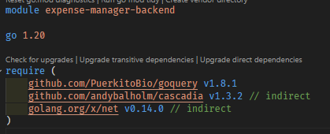

# Expense Manager App (Backend)

## 作品介紹

### 功能：

- 搭配網頁爬蟲，即時接收雙語財經新聞

  - **英語**：https://english.ftvnews.com.tw
  - **繁體中文**：https://www.cardu.com.tw

### 開發時長：

- 提供前端工程師爬取雙語及時新聞資料的 RESTful APIs，包含設計規劃，開發總時長為 1 日。

### APP 專案資料夾：

:file_folder: `app`

## DEMO 影片

## 技術清單

### Language

- **Golang** `v1.20` |

  - **Main Dependencies**

    - Goquery (`github.com/PuerkitoBio/goquery` v1.8.1)
    - Net (`golang.org/x/net` v0.14.0) - 提供前端工程師爬取及時新聞資料的 RESTful APIs

  - **All Dependencies**

    

### Cloud Services

- **Server**
  - Google Cloud Run

### Other Tools

- **Git** (Version control)
- **Docker** (Container)
- **Postman** (API tool)
